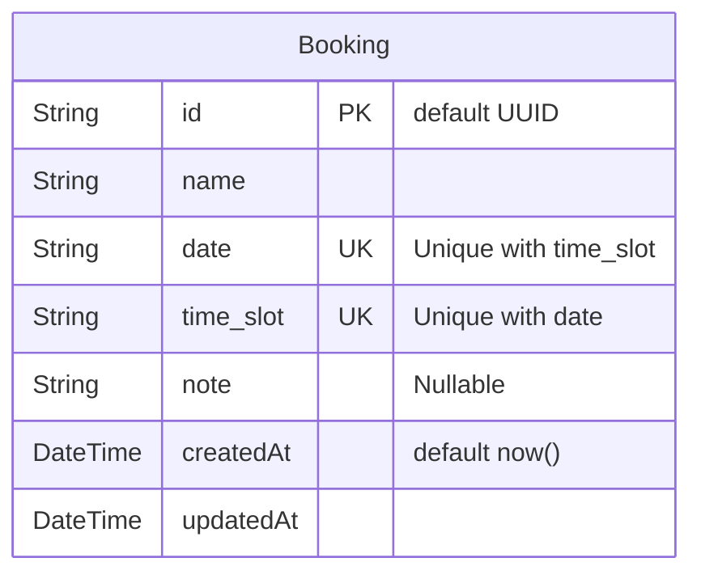

# NOTES

This document outlines the architectural decisions, the use of Artificial Intelligence tools, and the possible evolutions of the backend for the **Slotr** project.

---

### 1. Technical Decisions

The **NestJS** (Node.js/TypeScript) framework was chosen for the backend for several key reasons:
* **Stack Proficiency**: High familiarity with TypeScript and the NestJS architecture allowed for reduced development and initial configuration time, focusing attention on business requirements and concurrency.
* **Clean & Enterprise-grade Structure**: NestJS enforces a modular and strongly-typed architecture (inspired by Angular and Spring Boot), based on Dependency Injection, Controllers, Services, and DTOs. This ensures separation of concerns, maintainability, and ease of testing.
* **Ecosystem and Scalability**: The NestJS ecosystem is mature and growing, providing native support for REST, WebSockets, ORMs, and validation libraries (`class-validator`, `class-transformer`). Its decoupled architecture facilitates future transitions to microservices.
* **Persistence Abstraction (ORM + PostgreSQL)**: The system currently uses **PostgreSQL**, but data access is decoupled via an ORM. This allows replacing or supplementing the underlying database without rewriting business logic.
* **Containerization & Simplified Deployment**: The entire infrastructure (NestJS Application, PostgreSQL, and Redis for locks) is orchestrated via **Docker Compose**. This ensures full portability: a single command spins up the local development environment or deploys to a production server/VPS.
* **Concurrency and Uniqueness Management**: At the persistence layer, data integrity is guaranteed by a composite `UNIQUE(date, time_slot)` constraint in the database. This prevents server-side race conditions, translating constraint violations into `409 Conflict` HTTP responses.
* **Real-time Lock (Bonus)**: A WebSocket gateway backed by a Redis store with TTL was implemented to manage temporary slot locks while a user selects them, synchronizing the state in real-time across all connected clients.
* **Structured Logging & High Performance (Pino vs. Winston)**: The application utilizes **Pino** (via `nestjs-pino` and `pino-roll`) instead of alternative libraries such as Winston or Bunyan:
  * **Extreme Throughput & Low Latency**: In benchmarks, Pino is up to 5x faster than Winston due to optimized JSON serialization. In an API managing concurrent slot bookings and real-time state, minimal event-loop overhead is vital to maintaining predictable p99 response times.
  * **Non-Blocking Worker-Thread Transports**: Transports such as `pino-roll` (for daily rolling log files with 1-week retention) and `pino-pretty` (for development formatting) execute in dedicated Node.js worker threads (`worker_threads`). Disk I/O and file rotation operations never block the main event loop.
  * **AsyncLocalStorage Request Tracing**: `nestjs-pino` leverages Node.js `AsyncLocalStorage` rather than NestJS `REQUEST` scope injection. This achieves automatic correlation IDs (`req.id`, `x-request-id`) across asynchronous execution chains without the significant performance penalty of instantiating new DI service trees per HTTP request.
  * **Cloud-Native & Production Ready**: Structured JSON output out-of-the-box facilitates immediate ingestion into observability stacks (Datadog, Grafana Loki, ELK, AWS CloudWatch), while dynamically adjusting log verbosity by environment (`debug` in development, `info` in production).

---

### 2. Database Architecture

The persistence layer relies on a single `Booking` table. To ensure data integrity and prevent double bookings directly at the database level, a composite unique constraint is applied on the combination of `date` and `time_slot`.



---

### 3. Project Structure

The repository follows a standard, scalable NestJS architecture, grouped by feature domains:

```text
src/
├── app.module.ts             # Root application module orchestrating all feature modules
├── main.ts                   # Application entry point, setup of global pipes/interceptors
├── config/                   # Configuration management (e.g., loading environment variables)
├── common/                   # Shared resources across the application
│   ├── exceptions/           # Custom exception filters (e.g., handling DB unique constraints)
│   ├── guards/               # Security and authentication guards
│   ├── interceptors/         # Response formatting, logging, caching
│   └── decorators/           # Custom decorators
├── modules/                  # Feature modules
│   ├── bookings/             # Bookings Domain
│   │   ├── bookings.module.ts
│   │   ├── bookings.controller.ts # REST endpoints for bookings
│   │   ├── bookings.service.ts    # Business logic for bookings
│   │   ├── dto/                   # Data Transfer Objects with validation rules
│   │   ├── entities/              # Database models/entities
│   │   └── bookings.service.spec.ts # Unit tests for bookings
│   ├── events/               # WebSocket/Real-time Domain
│   │   ├── events.module.ts
│   │   ├── events.gateway.ts      # WebSocket gateway for real-time temporary locking
│   │   └── redis.service.ts       # Service to handle distributed Redis locks and TTL
│   └── database/             # Database connection and ORM setup
└── test/                     # End-to-End (E2E) tests simulating concurrent flows
```

---

### 4. AI Usage

During the development of this challenge, AI tools (Claude / ChatGPT / Copilot) were integrated into the workflow to optimize time:
* **Boilerplate and DTO Generation**: Rapid generation of DTO classes with corresponding validation annotations (`class-validator`) and base entity structures.
* **Unit and E2E Tests Writing**: Support in drafting test suites to simulate concurrent calls and verify the correct triggering of the `409 Conflict` exception.
* **Code Review & Sanity Check**: Verification and refinement of the WebSocket Gateway configurations and TTL management for temporary locks.
* **Manually Written/Verified Code**: All business logic, DB transaction management, custom HTTP exception filter mapping, module structuring, and the multi-stage `docker-compose.yml` for dev/prod were written, verified, and manually refactored.

---

### 5. What would be done with more time

Given additional time, the following enhancements would elevate the backend to an even more advanced level:
1. **Authentication and Authorization (RBAC)**: Optional integration of JWT/OAuth2 to distinguish general users from administrators (e.g., restricting cancellations or modifying schedule availability).
2. **Advanced Pagination and Performance Caching**: Adding pagination, dynamic filters on date ranges, and HTTP caching via Interceptors for read-only queries on occupied slots.
3. **Advanced Distributed Locking on Redis**: Refining the temporary lock algorithm using patterns like Redlock to guarantee complete consistency even in horizontal scaling scenarios across multiple backend instances.
4. **Asynchronous Notifications**: Introduction of a message queue (e.g., BullMQ) for decoupled handling of booking confirmation emails/SMS.
5. Setup **CI/CD** Pipelines
6. **Implement Unit and End-to-End Tests**